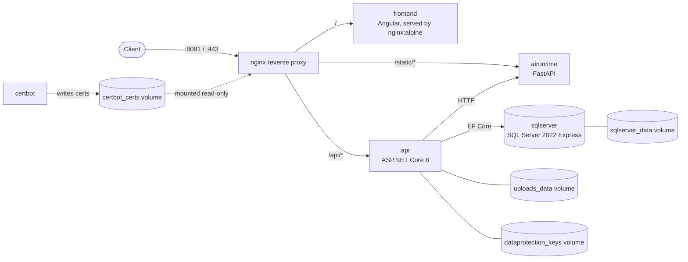

# PortfolioPlatform — Deployment

Docker Compose orchestration for the PortfolioPlatform stack: a reverse-proxied
set of four services (frontend, API, AI inference runtime, database) plus TLS
termination via nginx and Let's Encrypt. This repo contains no application
code — it wires together the other three repos, which are cloned as sibling
directories and built as part of `docker compose build`:

- [PortfolioPlatform-Frontend](https://github.com/vaibhav-jain17/PortfolioPlatform-Frontend) — Angular CMS/portfolio UI
- [PortfolioPlatform-Backend](https://github.com/vaibhav-jain17/PortfolioPlatform-Backend) — ASP.NET Core API
- [PortfolioPlatform-AI](https://github.com/vaibhav-jain17/PortfolioPlatform-AI) — FastAPI inference runtime

> This code is publicly viewable for portfolio and demonstration purposes.
> All rights reserved — no license is granted for reuse, modification, or redistribution.

## Architecture



Routing is defined in [nginx/nginx.local.conf](nginx/nginx.local.conf) (HTTP-only,
for local dev) and [nginx/nginx.prod.conf](nginx/nginx.prod.conf) (adds the
HTTPS server block, Let's Encrypt cert paths, and the HTTP→HTTPS redirect).
Which one is mounted into the nginx container is controlled by the
`NGINX_CONF_FILE` variable in [docker-compose.yml](docker-compose.yml).

## Tech stack

- **Orchestration:** Docker Compose
- **Reverse proxy / TLS:** nginx (`nginx:alpine`), certbot (Let's Encrypt)
- **Database:** Microsoft SQL Server 2022 (Express edition)
- **API:** ASP.NET Core 8 (.NET 8), EF Core 8, JWT bearer auth, Swashbuckle/OpenAPI
- **AI runtime:** FastAPI on Python 3.12, scikit-learn, OpenCV, served by uvicorn
- **Frontend:** Angular 17

## Features

- Single-command orchestration of all four services behind one nginx entrypoint
- Path-based routing: `/` → frontend, `/api/` → API, `/static/` → AI runtime
- Local vs. production nginx config switch (`NGINX_CONF_FILE`) — HTTP-only
  locally, automatic Let's Encrypt TLS + HTTP→HTTPS redirect in production
- Configurable host port for local dev (`NGINX_PORT`, defaults to `8081`)
- Named volumes persist state across container recreation: uploaded files,
  ASP.NET Data Protection keys, SQL Server data, and TLS certificates
- API startup is gated on a SQL Server healthcheck, so the API container
  won't start racing an unready database

## Screenshots

<!-- [ADD SCREENSHOT HERE] -->


## Local setup

### Prerequisites

- Docker Desktop / Docker Engine with the Compose plugin
- This repo and its three sibling repos cloned **side by side in the same
  parent directory**, with these exact folder names (the compose file
  references them as `../PortfolioPlatform-AI`, etc., relative to its own
  location):

  ```
  some-parent-dir/
    PortfolioPlatform-Deployment/   (this repo)
    PortfolioPlatform-AI/
    PortfolioPlatform-Backend/
    PortfolioPlatform-Frontend/
  ```

### Steps

1. Clone all four repos as shown above.
2. From `PortfolioPlatform-Deployment/`, copy the env template and fill it in:

   ```
   cp .env.example .env
   ```

   Required values in `.env`:
   - `SQL_SA_PASSWORD` — must satisfy SQL Server's password complexity policy
     (8+ characters, with at least three of: uppercase, lowercase, digit,
     symbol). The `change_me` placeholder does **not** satisfy this and will
     fail on container startup — pick a real password.
   - `JWT_KEY` — at least 32 characters; the API throws on startup if it's
     shorter.
   - `ADMIN_EMAIL`, `ADMIN_PASSWORD`, `ADMIN_ROLE` — seeded admin account.

   Optional (both have working defaults, override only if needed):
   - `NGINX_PORT` — host port for local HTTP access (default `8081`).
   - `NGINX_CONF_FILE` — which nginx config to mount (default
     `nginx.local.conf`; use `nginx.prod.conf` for the TLS setup, which
     requires certs already issued into the `certbot_certs` volume).

3. Build and start everything:

   ```
   docker compose up --build
   ```

4. Visit `http://localhost:8081` (or your `NGINX_PORT`). API endpoints are
   available under `/api/`; `/static/` serves static demo assets (e.g. sample
   images) — the AI runtime's actual inference API is not exposed publicly
   and is reached only internally, through the API's Execution Gateway.

### Production TLS

`nginx.prod.conf` expects certificates at
`/etc/letsencrypt/live/<domain>/{fullchain,privkey}.pem` inside the
`certbot_certs` volume, and serves the ACME HTTP-01 challenge from the
`certbot_webroot` volume. The `certbot` service in this compose file is a
no-op placeholder (`entrypoint: "true"`) — it exists to share those two
volumes with nginx; actual certificate issuance/renewal is run on demand
against the same volumes, e.g.:

```
docker compose run --rm --entrypoint certbot certbot certonly --webroot \
  -w /var/www/certbot -d <your-domain> --email <your-email> \
  --agree-tos --no-eff-email
```

`--entrypoint certbot` is required to override the service's default no-op
`entrypoint: "true"` (used only to keep the container idle for volume-sharing
with nginx) so the actual `certbot` binary runs instead.

then set `NGINX_CONF_FILE=nginx.prod.conf` and restart the `nginx` service.

## CI/CD Pipeline

Pushes to `main` (or a manual trigger) run a two-stage GitHub Actions pipeline
defined in [.github/workflows/pipeline.yml](.github/workflows/pipeline.yml):

1. **Build** — checks out this repo and the three sibling repos, validates
   `docker-compose.yml`, and builds all three custom service images
   (frontend, API, AI runtime) to confirm they compile cleanly.
2. **Deploy** — gated behind a required manual approval (a GitHub
   Environment named `production`). Once approved, it SSHes into the
   production VPS using a dedicated deploy key and runs
   [scripts/deploy.sh](scripts/deploy.sh), which pulls the latest code
   across all four repos, rebuilds and restarts the stack, and explicitly
   restarts nginx to avoid serving stale upstream DNS for a recreated
   container. A final health check hits `/api/projects` over the real
   public domain to confirm the full stack — not just the containers,
   but Nginx, the API, and the database — is genuinely responding
   correctly before the pipeline is marked successful.
